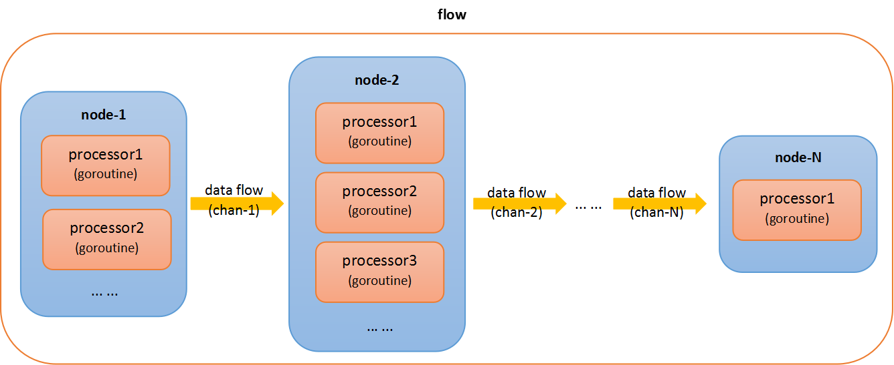

Flow and Parallel processing framework
==================================================
It provides a easy way to create a flow process and significantly improve the efficiency of data processing. 

Architecture Diagram
---------

## Usage
For example, we count the file words and get the top 10 occurrences of the words. 
The test file is too small, you can enlarge the file by copying it several times. Let's compare the two ways below:
### 1、General way
```go
	wordCount := map[string]int{}
	reverse := true
	//You can replace the file with a larger file.
	file := "testfile/2553.txt"
	start := time.Now()
	f, err := os.Open(file)
	if err != nil {
		panic(err)
	}
	defer f.Close()

	sc := bufio.NewScanner(f)
	//split lines
	for sc.Scan() {
		line := sc.Text()
		sps := splitText(line)
		for i := 0; i < len(sps); i++ {
			st := strings.TrimSpace(sps[i])
			if len(st) > 0 {
				wordCount[st]++
			}
		}
	}
	//sort by word occurrence times desc
	sortedWc := sortWc(wordCount, reverse)

	duration := time.Since(start)

	//print elapsed time
	fmt.Printf("duration(ms):%v\n", duration.Milliseconds())

	//print topN
	topN := 10
	if topN > len(sortedWc) {
		topN = len(sortedWc)
	}
	fmt.Println("sortedWc-top", topN, ":")
	for i := 0; i < topN; i++ {
		fmt.Println(sortedWc[i])
	}
```
The 'General way' is slow and has lower CPU and IO usage when the file is very large.

### 2、Flow and Parallel way
We separate IO and CPU operations.
#### (1) define flownode-0 processor ( read file lines )
```go
//ReadFileProcessor reads file lines, and put the line into a OutTaskChan for next flow-node to process. 
type ReadFileProcessor struct {
	Filepath string
}

func (g *ReadFileProcessor) Proccess(inTasks flowprocess.InTaskChan, outTask flowprocess.OutTaskChan, ctx context.Context) (cancelAllProcess bool)  {
	f, err := os.Open(g.Filepath)
	if err != nil {
		panic(err)
	}
	defer f.Close()

	sc := bufio.NewScanner(f)
	for sc.Scan() {
		select {
		case <- ctx.Done() :
			return
		default:
			line := sc.Text()
			outTask <- line
		}
	}
	return 
}
```
#### (2) define flownode-1 processor ( split and count )
```go
//SplitAndCountProcessor splits the line and counts the word occurrence.
type SplitAndCountProcessor struct {
}

func (s *SplitAndCountProcessor) Proccess(inTasks flowprocess.InTaskChan, outTask flowprocess.OutTaskChan, ctx context.Context) (cancelAllProcess bool)  {
	wordCount := map[string]int{}
	for {
		select {
		case <-ctx.Done():
			return true
		case task, ok := <-inTasks:
			if ok {
				line := task.(string)
				sps := splitText(line)
				for i := 0; i < len(sps); i++ {
					st := strings.TrimSpace(sps[i])
					if len(st) > 0 {
						wordCount[st]++
					}
				}
			} else {
				outTask <- wordCount
				return
			}
		}
	}
}
```
#### (3) define flownode-2 processor ( summarize )
```go
//SumWordCountProcessor summarizes the word occurrence.
type SumWordCountProcessor struct {
	reverse   bool
}

func (s *SumWordCountProcessor) Proccess(inTasks flowprocess.InTaskChan, outTask flowprocess.OutTaskChan, ctx context.Context) (cancelAllProcess bool)  {
	wordCount := map[string]int{}
	for {
		select {
		case <-ctx.Done():
			return true
		case task, ok := <-inTasks:
			if ok {
				wc := task.(map[string]int)
				for key, val := range wc {
					wordCount[key] += val
				}
			} else {
				sortedWc := sortWc(wordCount, s.reverse)
				outTask <- sortedWc
				return
			}
		}
	}
}
```
#### (4) define flow process
```go
    start := time.Now()
	fp := flowprocess.NewFlow(nil,nil,nil)
	queneCount := 4000
	//Node-0: read file lines. We define 1 processor to read file.
	fp.AddNodeProcessors(queneCount,
		&ReadFileProcessor{
			//You can replace the file with a larger file.
			Filepath: "testfile/2553.txt",
		})

	//Node-1: split and count. we define 4 parallel processors to split and count.
	fp.AddNodeProcessors(queneCount,
		&SplitAndCountProcessor{},
		&SplitAndCountProcessor{},
		&SplitAndCountProcessor{},
		&SplitAndCountProcessor{},
	)

	result := &SumWordCountProcessor{
		reverse: true,
	}

	//Node-2: we define 1 processor to summarize.
	fp.AddNodeProcessors(1,
		result,
	)

	fp.Start()
	if res, ok := fp.Result(); ok {
		sortedWc := res.([]wordAndCount)
		duration := time.Since(start)
		fmt.Printf("duration(ms):%v\n", duration.Milliseconds())

		topN := 10
		if topN > len(sortedWc) {
			topN = len(sortedWc)
		}
		fmt.Println("sortedWc-top", topN, ":")
		for i := 0; i < topN; i++ {
			fmt.Println(sortedWc[i])
		}
	}
```
The 'Flow and Parallel way' is faster and has higher CPU and IO usage when the file is very large.